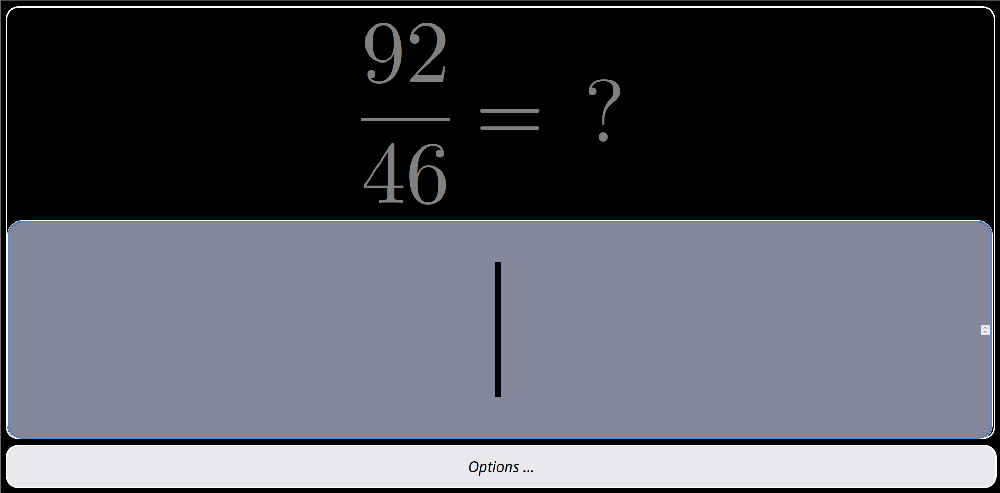
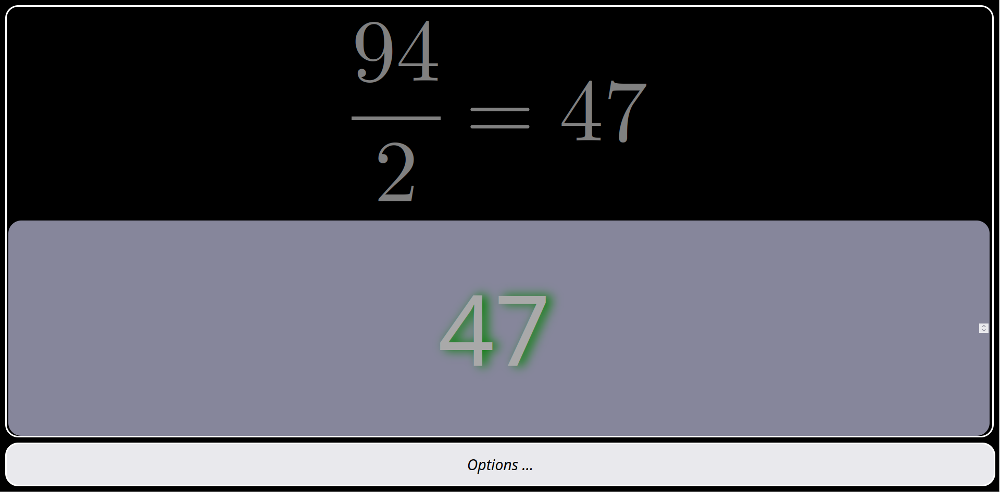
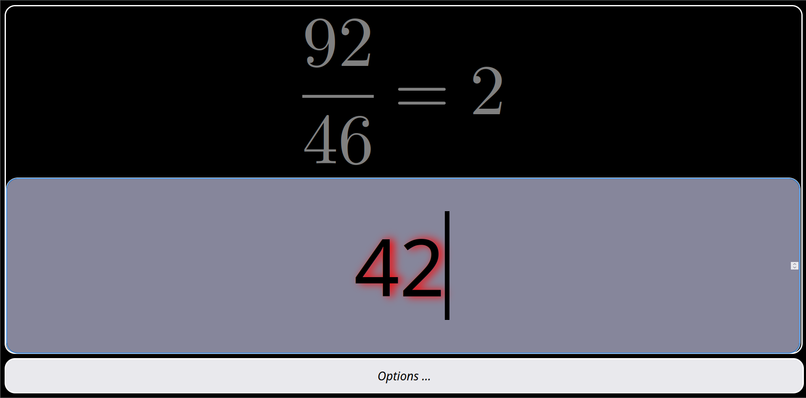

#  CalcMenthe   🔢

https://somebodylikeeverybody.github.io/CalcMenthe/

  
   
  

---

- Full front end website to train and practice mental calculus
- Works well on  computer, smartphones and tablets (responsive design) 🤳
- Able to run offline, even with the file:// protocol by drag 'n dropping index.htm in your browser
- 5 training themes that can be combined in the options menu:
  - squares
  - cubes
  - additions
  - substractions
  - multiplications
  - divisions
  - modulos

- An options menu to select which theme we want to train and with which range of numbers

---

- Possible upgrades:
  - derivatives
  - integrals
  - litteral calculus
  - anatomy quiz
  - anything needed...
  
